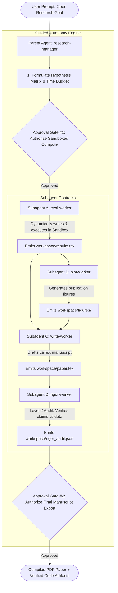

# ForgeResearcher 🔬⚡

> **Autonomous Empirical ML Research Harness built on TrueForge with Guided Autonomy, Sandboxed Execution, Multi-Subagent Routing, 5 Dedicated MCP Servers, and Qodo Code Review.**

Developed for the **WeMakeDevs Agent Harness Hackathon (TrueForge)** in partnership with **TrueFoundry** & **Qodo**.

---

## 🌟 Guided Autonomy Architecture

**ForgeResearcher** replaces rigid static templates with an **open-ended, contract-bounded research harness**:



---

## 🔌 5 Dedicated FastMCP Servers

| FastMCP Server | Path | Tools Provided |
| :--- | :--- | :--- |
| **`ArXivServer`** | `mcp_servers/arxiv_mcp/server.py` | `search_arxiv`: Queries arXiv API over HTTPS for titles, abstracts, and author citations. |
| **`ScholarServer`** | `mcp_servers/scholar_mcp/server.py` | `search_semantic_scholar`: Semantic Scholar & Google Scholar citation tracking and PDF lookups. |
| **`KaggleColabServer`** | `mcp_servers/kaggle_colab_mcp/server.py` | `search_open_datasets`: Discovers datasets; `check_compute_environment`: Profiles compute boundaries. |
| **`LaTeXCompilerServer`** | `mcp_servers/latex_compiler_mcp/server.py` | `render_latex_manuscript`: 2-column LaTeX compiler; `audit_scientific_claims`: Level-2 rigor auditor. |
| **`ResearchLabServer`** | `mcp_servers/research_lab_mcp/server.py` | `profile_dataset`: Data summarizer; `generate_publication_plots`: Dual-axis plotting engine. |

All servers are wired in `trueforge_config/mcp_settings.json`.

---

## 🛡️ Subagents & Responsibilities

| Subagent | Role | Input Contract | Output Contract |
| :--- | :--- | :--- | :--- |
| **`research-manager`** (Parent) | Orchestrator & Approval Owner | User's open research objective | Orchestrates subagents, manages human approval gates, verifies output. |
| **`eval-worker`** | ML Code Writer & Sandbox Runner | Hypothesis specification & dataset target | Generates dynamic training script in `workspace/`, runs in TrueForge sandbox, outputs `results.tsv`. |
| **`plot-worker`** | Publication Visualizer | `results.tsv` | Generates 2 publication-ready charts (e.g. learning curve & metric comparison bar chart) in `workspace/figures/`. |
| **`write-worker`** | Academic LaTeX Author | Research plan + `results.tsv` + figures | Produces 2-column LaTeX manuscript (`workspace/paper.tex`). |
| **`rigor-worker`** | Scientific Auditor | `paper.tex` + `results.tsv` | Audits manuscript claims against empirical metrics to ensure zero hallucinations; outputs `rigor_audit.json`. |

---

## 🚀 Quick Start (Local Setup)

### 1. Environment Setup
```bash
# Uses uv (fast Python package manager)
uv venv .venv
source .venv/bin/activate
uv pip install -r <(echo "pytest mcp pandas matplotlib scikit-learn numpy")
```

### 2. Run Test Suite (8 Test Cases across 5 MCP Servers)
```bash
.venv/bin/python -m pytest tests/
```

### 3. Run End-to-End Simulation
```bash
PYTHONPATH=. .venv/bin/python run_end_to_end_simulation.py
```

### 4. Launch TrueForge Harness
```bash
npx @truefoundry/trueforge@latest
# Open TrueForge dashboard on http://localhost:8790
```

---

## 🔍 Qodo Code Review Evidence

In accordance with hackathon engineering best practices, every substantive feature was developed through branch-based Pull Requests reviewed by **Qodo** before merge:

- **[PR #1: FastMCP Research Lab Server & Verification Suite](https://github.com/Its-Atharva-Gupta/forge-researcher/pull/1)**
  - *Summary:* Implemented initial FastMCP tools for dataset profiling, plotting, and code validation.
- **[PR #2: Karpathy-style 3-File AutoResearch Sandbox Environment](https://github.com/Its-Atharva-Gupta/forge-researcher/pull/2)**
  - *Summary:* Prototyped initial benchmark sandbox environment.
- **[PR #3: TrueForge Agent Skills, Subagent Hierarchy, and Approval Gates](https://github.com/Its-Atharva-Gupta/forge-researcher/pull/3)**
  - *Summary:* Configured subagent hierarchy and defined approval gates in `trueforge_config/agent.yaml`.
- **[PR #4: Guided Autonomy Parent Manager and 4-Subagent Hierarchy](https://github.com/Its-Atharva-Gupta/forge-researcher/pull/4)**
  - *Summary:* Full refactor to Guided Autonomy: Parent `research-manager`, contracted subagents (`eval-worker`, `plot-worker`, `write-worker`, `rigor-worker`), integrated arXiv tool, and Level-2 rigor auditor.
- **[PR #5: Fix MCP Server based on Qodo Review Findings](https://github.com/Its-Atharva-Gupta/forge-researcher/pull/5)**
  - *Summary:* Fixed all issues surfaced by Qodo: upgraded arXiv API to HTTPS transport, enforced strict metric column validation in plotting to prevent blank images, and added LaTeX special character escaping.
- **[PR #6: Add Dedicated Modular FastMCP Servers for arXiv, Scholar, Kaggle/Colab, and LaTeX](https://github.com/Its-Atharva-Gupta/forge-researcher/pull/6)**
  - *Summary:* Decomposed research tooling into 5 dedicated FastMCP servers with 8 comprehensive unit tests.

---

## 📁 Repository Structure

```
.
├── mcp_servers/
│   ├── arxiv_mcp/              # Dedicated arXiv API FastMCP server
│   │   └── server.py
│   ├── scholar_mcp/            # Dedicated Google Scholar & Semantic Scholar FastMCP server
│   │   └── server.py
│   ├── kaggle_colab_mcp/       # Dedicated Dataset Discovery & Compute Profiler FastMCP server
│   │   └── server.py
│   ├── latex_compiler_mcp/     # Dedicated LaTeX Compiler & Level-2 Rigor FastMCP server
│   │   └── server.py
│   └── research_lab_mcp/       # Dataset Profiling & Plotting FastMCP server
│       └── server.py
├── skills/                     # Modular Skill Definitions
│   ├── research_manager/       # Parent orchestrator & approval logic
│   ├── eval_worker/            # Sandboxed ML execution & metric contract
│   ├── plot_worker/            # Publication visualizer
│   ├── write_worker/           # Academic LaTeX drafting
│   └── rigor_worker/           # Level-2 Fact-check & claim verification
├── trueforge_config/
│   ├── agent.yaml              # TrueForge agent definition & approval gates
│   └── mcp_settings.json       # MCP configuration wiring all 5 servers
├── run_end_to_end_simulation.py # Full executable pipeline simulation script
├── tests/                      # Automated verification test suite (8 tests)
└── docs/
    ├── REQUIREMENTS.md         # Hackathon requirements dossier
    └── DEMO_SCRIPT.md          # 3-minute video presentation guide
```
