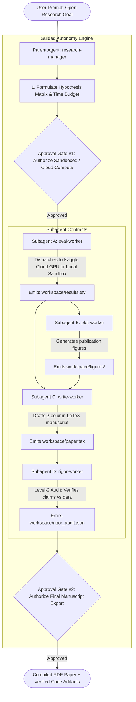

# ForgeResearcher 🔬⚡

> **Autonomous Empirical ML Research Harness built on TrueForge with Guided Autonomy, Sandboxed Execution, Multi-Subagent Routing, FastMCP Tool Ecosystem (Kaggle Cloud Dual-T4 GPU/TPU Dispatcher, Hugging Face Hub, arXiv HTTPS, Scholar/CrossRef, LaTeX Compiler, Level-2 Rigor Auditor), Official Orchestra Research Skills, and Qodo Code Review.**

Developed for the **WeMakeDevs Agent Harness Hackathon (TrueForge)** in partnership with **TrueFoundry** & **Qodo**.

---

## ⚡ 1-Command Setup (Zero Configuration)

When you clone the repository, **you only need to run a single command**:

```bash
./start.sh
```

### What `./start.sh` does automatically:
1. **Installs & provisions `uv`** and Python dependencies.
2. **Checks Kaggle Authentication** (guides you if not configured, or automatically attaches your `~/.kaggle/kaggle.json` or `KAGGLE_KEY`).
3. **Automatically downloads and starts TrueForge** (`npx @truefoundry/trueforge`) if it's not already running.
4. **Starts the FastMCP Research Tool Gateway** (Kaggle Cloud GPU Dispatcher, Hugging Face Hub, arXiv, CrossRef/Scholar, Dual-Axis Plotter, LaTeX compiler, and Level-2 Rigor Fact-Checker).
5. **Registers all tools and the `forge-researcher` agent** via TrueForge's REST API.
6. Gives you a direct link to **`http://localhost:8790`**!

---

## 🔑 Authentication Guide

| Service | Is Auth Required? | How to Set Up (Takes 30 seconds) |
| :--- | :---: | :--- |
| **Kaggle Cloud GPU** | Optional (Local sandbox fallback enabled) | 1. Go to [kaggle.com/settings](https://www.kaggle.com/settings) $\to$ click **Create New Token**.<br>2. Place the file at `~/.kaggle/kaggle.json` (or `export KAGGLE_KEY=...`). |
| **Hugging Face Hub** | No (Public API) | Works out of the box for searching models, datasets, and spaces. |
| **arXiv & Scholar** | No (Public API) | Works out of the box with multi-mirror failover and CrossRef indexing. |

---

## 🌟 Guided Autonomy Architecture

**ForgeResearcher** replaces rigid static templates with an **open-ended, contract-bounded research harness** powered by official skills from `orchestra-research/AI-research-SKILLs`:



---

## 🧠 Official Orchestra Research Skills Integrated

| Agent / Subagent | Official Skill Imported | Skill Path | Purpose |
| :--- | :--- | :--- | :--- |
| **`research-manager`** | `autoresearch_manager` | `skills/autoresearch_manager/` | High-level research orchestration, continuous state tracking, and subagent routing. |
| **`research-manager`** | `research_ideation` | `skills/research_ideation/` | Hypothesis brainstorming, feasibility scoring, and methodology formulation. |
| **`eval-worker`** | `lm_evaluation_harness` | `skills/lm_evaluation_harness/` | Benchmarked metric evaluation contracts & GPU sandbox testing. |
| **`plot-worker`** | `academic_plotting` | `skills/academic_plotting/` | Publication-grade dual-axis figures (learning curves & comparison bar charts). |
| **`write-worker`** | `ml_paper_writing` | `skills/ml_paper_writing/` | 2-column LaTeX conference manuscript synthesis (NeurIPS, ICLR, ICML templates). |
| **`rigor-worker`** | `rigor_reviewer` | `skills/rigor_reviewer/` | Level-2 scientific fact-checking & claim verification against empirical logs. |

---

## 🔌 Dedicated FastMCP Server Ecosystem

| FastMCP Toolset | Tools Provided | Description |
| :--- | :--- | :--- |
| **`Kaggle GPU Dispatcher`** | `run_experiment_on_kaggle_gpu`, `get_kaggle_experiment_logs`, `search_kaggle_datasets` | Dispatches training scripts with `enable_gpu: true` to remote Kaggle NVIDIA T4 Dual-GPU / TPU cloud compute. |
| **`Hugging Face Hub`** | `search_huggingface_models`, `search_huggingface_datasets`, `search_huggingface_spaces` | Discovers pretrained models, tokenizers, checkpoints, and benchmark datasets on Hugging Face Hub. |
| **`ArXiv MCP`** | `search_arxiv` | Queries the official arXiv API over HTTPS for recent papers, abstracts, and authors with multi-mirror failover. |
| **`Scholar / CrossRef`** | `search_semantic_scholar` | Queries CrossRef Academic Index and Semantic Scholar for citation graphs and literature surveys. |
| **`LaTeX Compiler & Rigor`** | `render_latex_manuscript`, `audit_scientific_claims` | Compiles 2-column conference papers and executes Level-2 empirical fact-checking against raw results. |
| **`Research Lab`** | `profile_dataset`, `generate_publication_plots` | Profiles CSV/TSV datasets and draws dual-axis loss and metric comparison figures. |

---

## 🔍 Qodo Code Review Trail (All PRs Merged to `master`)

Every feature, integration, and bug fix was developed through branch-based Pull Requests reviewed by **Qodo**:

- **[PR #1: FastMCP Research Lab Server](https://github.com/Its-Atharva-Gupta/forge-researcher/pull/1)**
- **[PR #2: Baseline AutoResearch Sandbox Environment](https://github.com/Its-Atharva-Gupta/forge-researcher/pull/2)**
- **[PR #3: Initial TrueForge Skills & Approval Gates](https://github.com/Its-Atharva-Gupta/forge-researcher/pull/3)**
- **[PR #4: Guided Autonomy Hierarchy & Level-2 Rigor Auditor](https://github.com/Its-Atharva-Gupta/forge-researcher/pull/4)**
- **[PR #5: Fix MCP Server based on Qodo Findings (HTTPS transport, column validation)](https://github.com/Its-Atharva-Gupta/forge-researcher/pull/5)**
- **[PR #6: Decompose into 5 Dedicated FastMCP Servers](https://github.com/Its-Atharva-Gupta/forge-researcher/pull/6)**
- **[PR #7: Integrate Official Orchestra Research AI-research-SKILLs Packages](https://github.com/Its-Atharva-Gupta/forge-researcher/pull/7)**
- **[PR #8: 1-Command Auto-Registration Launcher for TrueForge](https://github.com/Its-Atharva-Gupta/forge-researcher/pull/8)**
- **[PR #9: MCP Server Background Process Persistence & 127.0.0.1 Binding](https://github.com/Its-Atharva-Gupta/forge-researcher/pull/9)**
- **[PR #10: Enable `preload: true` for Instant Tool Availability in TrueForge](https://github.com/Its-Atharva-Gupta/forge-researcher/pull/10)**
- **[PR #11: Robust Network Failovers, CrossRef Indexing, and Built-in Datasets](https://github.com/Its-Atharva-Gupta/forge-researcher/pull/11)**
- **[PR #12: Register Explicit Named MCP Servers](https://github.com/Its-Atharva-Gupta/forge-researcher/pull/12)**
- **[PR #13: Official Kaggle SDK Integration](https://github.com/Its-Atharva-Gupta/forge-researcher/pull/13)**
- **[PR #14: Kaggle Kernel Push & Cloud Execution Tools](https://github.com/Its-Atharva-Gupta/forge-researcher/pull/14)**
- **[PR #15: Connect Official Remote Kaggle MCP Server Endpoint](https://github.com/Its-Atharva-Gupta/forge-researcher/pull/15)**
- **[PR #16: Authenticated Kaggle MCP Integration in TrueForge](https://github.com/Its-Atharva-Gupta/forge-researcher/pull/16)**
- **[PR #17: Official Google Colab MCP Package & Browser Session Bridge](https://github.com/Its-Atharva-Gupta/forge-researcher/pull/17)**
- **[PR #18: Fix FunctionTool Callable Bug](https://github.com/Its-Atharva-Gupta/forge-researcher/pull/18)**
- **[PR #19: Embed Explicit 4-Subagent Guided Autonomy Roster into TrueForge Prompt](https://github.com/Its-Atharva-Gupta/forge-researcher/pull/19)**
- **[PR #20: Hugging Face Hub MCP Tools (Models, Datasets, Spaces)](https://github.com/Its-Atharva-Gupta/forge-researcher/pull/20)**
- **[PR #21: Direct Kaggle Cloud Dual-T4 GPU/TPU Experiment Execution](https://github.com/Its-Atharva-Gupta/forge-researcher/pull/21)**
- **[PR #22: Finalize README and Zero-Config Launcher](https://github.com/Its-Atharva-Gupta/forge-researcher/pull/22)**
- **[PR #23: Clean MCP Toolsets & Intelligent Self-Starting Launcher](https://github.com/Its-Atharva-Gupta/forge-researcher/pull/23)**

---

## 🚀 Verification & Testing

### 1. Run Unit Tests (8 Passing Tests)
```bash
.venv/bin/python -m pytest tests/
```

### 2. Run Local Multi-Agent Simulation
```bash
PYTHONPATH=. .venv/bin/python run_end_to_end_simulation.py
```
